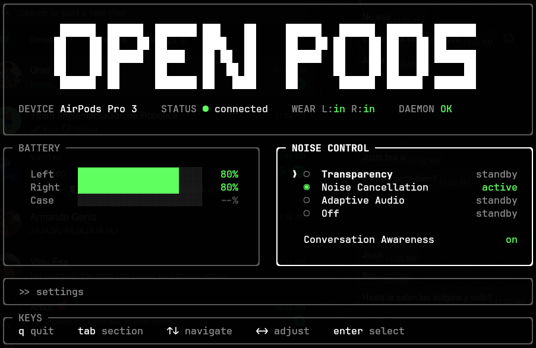

# open-pods

A terminal UI for managing AirPods and compatible Apple/Beats headphones on Linux.
It talks to Apple's AACP control channel over Bluetooth, keeps that session alive
in a small daemon, and exposes battery, noise control, device settings, media
controls, audio handoff, and Waybar output from the terminal.

<p align="center">
  
</p>

## Features

- **Battery status** for left/right buds, case, and headphone-style models
- **Noise control**: Off, Transparency, Adaptive, and Noise Cancellation when supported by the model
- **Model-aware settings**:
  - Conversation Awareness
  - Noise Cancellation with one AirPod
  - Personalized Volume
  - Volume Swipe
  - Press Speed and Press & Hold
  - Tone Volume
  - Volume Swipe Length
  - Mic Mode
  - Auto Connect
- **Ear detection** and device status in the TUI
- **Stem press media controls** through MPRIS
- **PulseAudio/PipeWire audio routing** for A2DP activation and sink switching
- **iPhone <-> Linux handoff support** with automatic and manual audio reclaim
- **Waybar integration** through JSON output (`--waybar` / `--waybar-watch`)
- **Background daemon** with Unix-socket IPC so the TUI can attach to live state
- **Apple/Beats model detection** with safe fallbacks for unknown Apple headphones

## Quick Install

For Debian/Ubuntu users who just want it working, copy and paste this:

> [!IMPORTANT]
> If your AirPods were already paired before this setup, remove them and pair after installation:
> ```bash
> bluetoothctl remove <AIRPODS_MAC>
> ```

Installation:

```bash
# Clone .deb
curl -LO https://github.com/JossueE/open-pods/releases/latest/download/open-pods_amd64.deb
sudo apt install ./open-pods_amd64.deb

# Set necessary Bluetooth Configurations
sudo cp -n /etc/bluetooth/main.conf /etc/bluetooth/main.conf.open-pods.bak
if sudo grep -qE '^[[:space:]]*DeviceID[[:space:]]*=' /etc/bluetooth/main.conf; then
    sudo sed -i 's|^[[:space:]]*DeviceID[[:space:]]*=.*|DeviceID = bluetooth:004C:0000:0000|' /etc/bluetooth/main.conf
elif sudo grep -q '^\[General\]' /etc/bluetooth/main.conf; then
    sudo sed -i '/^\[General\]/a DeviceID = bluetooth:004C:0000:0000' /etc/bluetooth/main.conf
else
    printf '\n[General]\nDeviceID = bluetooth:004C:0000:0000\n' | sudo tee -a /etc/bluetooth/main.conf >/dev/null
fi

sudo systemctl restart bluetooth

# Activate Open-pods
systemctl --user daemon-reload
systemctl --user enable --now open-pods.service

# Enable tap gestures (double tap = next, triple tap = previous).
# AirPods send these as Bluetooth AVRCP commands; mpris-proxy (from bluez)
# forwards them to your media player.
systemctl --user enable --now mpris-proxy.service \
  || { mkdir -p ~/.config/systemd/user
       printf '[Unit]\nDescription=Forward bluetooth AVRCP controls to MPRIS players\nAfter=bluetooth.target sound.target\n\n[Service]\nExecStart=/usr/bin/mpris-proxy\nRestart=on-failure\nRestartSec=2\n\n[Install]\nWantedBy=default.target\n' > ~/.config/systemd/user/mpris-proxy.service
       systemctl --user daemon-reload
       systemctl --user enable --now mpris-proxy.service; }
```

## Recommended Ubuntu-GNOME Indicator

The GNOME Shell extension shows AirPods status in the top bar with a Liquid
Glass styled menu: per-bud battery meters, inline media controls (previous /
play-pause / next via MPRIS), and a segmented noise-control switch
(Off / Transparency / Adaptive / ANC). Advanced actions (reclaim audio, open the
full TUI, battery detail) live in a secondary settings view.

It uses `open-pods --waybar-watch` for live status, `open-pods --set-noise MODE`
for noise control, `open-pods --reclaim` for reclaiming audio, and opens the full
TUI with `gnome-terminal -- open-pods`.

Install it manually:

```bash
mkdir -p ~/.local/share/gnome-shell/extensions
rm -rf ~/.local/share/gnome-shell/extensions/open-pods@jossuee.dev
cp -r extensions/gnome/open-pods@jossuee.dev ~/.local/share/gnome-shell/extensions/
gnome-extensions enable open-pods@jossuee.dev
```

If GNOME does not load it immediately, log out and log back in.


## Usage

Use apple Gestures or to open the terminal TUI
```bash
open-pods
```

## Build From Source

### Dependencies

On Debian/Ubuntu-like systems, the build dependencies are typically:

```bash
sudo apt install build-essential cmake pkg-config libdbus-1-dev libbluetooth-dev libpulse-dev nlohmann-json3-dev
```

Build-time:

- C++20 compiler
- CMake 3.16 or newer
- pkg-config
- D-Bus development headers (`dbus-1`)
- BlueZ/libbluetooth development headers
- libpulse development headers
- nlohmann/json headers

Runtime:

- BlueZ
- D-Bus
- PulseAudio or PipeWire with PulseAudio compatibility

Optional integrations:

- `wpctl` for the default volume command
- `notify-send` for battery notifications
- Any OSD command you configure for volume feedback


### From source

```bash
git clone https://github.com/JossueE/open-pods.git
cd open-pods
cmake -S . -B build -DCMAKE_BUILD_TYPE=Release
cmake --build build -j
```

Run from the build directory:

```bash
./build/open-pods --help
```

Install manually if you want `open-pods` on your `PATH`:

```bash
sudo install -Dm755 build/open-pods /usr/local/bin/open-pods
```

### Debian package

You can also build a local `.deb` package:

```bash
cmake -S . -B build -DCMAKE_BUILD_TYPE=Release
cmake --build build -j
cpack --config build/CPackConfig.cmake
sudo apt install ./build/open-pods_*.deb
```

The package installs the binary to `/usr/bin/open-pods`.

If you built the `.deb` yourself, run the Bluetooth and systemd commands from
[Quick Install](#quick-install) after installing it.

### Publishing a release

Push a version tag to build and upload the Debian package automatically:

```bash
git tag v0.1.0
git push origin v0.1.0
```

## Usage

The package installs a user daemon. Enable it once:

```bash
systemctl --user daemon-reload
systemctl --user enable --now open-pods.service

# Tap gestures (double = next, triple = previous) ride on Bluetooth AVRCP;
# mpris-proxy (from bluez) forwards them to your media player.
systemctl --user enable --now mpris-proxy.service \
  || { mkdir -p ~/.config/systemd/user
       printf '[Unit]\nDescription=Forward bluetooth AVRCP controls to MPRIS players\nAfter=bluetooth.target sound.target\n\n[Service]\nExecStart=/usr/bin/mpris-proxy\nRestart=on-failure\nRestartSec=2\n\n[Install]\nWantedBy=default.target\n' > ~/.config/systemd/user/mpris-proxy.service
       systemctl --user daemon-reload
       systemctl --user enable --now mpris-proxy.service; }
```

Then open the TUI:

```bash
open-pods
```

Check daemon logs with:

```bash
journalctl --user -u open-pods.service
```

The packaged service runs `open-pods --daemon -d`, so debug logs are included in
the journal.

Available commands:

```text
open-pods                 # launch TUI
open-pods --daemon        # run the headless daemon
open-pods --reclaim       # force AirPods audio back to this Linux host
open-pods --set-noise MODE # set noise control: off|anc|transparency|adaptive
open-pods -d, --debug     # enable debug logging
open-pods -v, --version   # show version and exit
open-pods -h, --help      # show help
```

## Keys

| Key | Action |
|-----|--------|
| `q` / `Ctrl+C` | Quit |
| `Tab` / `Shift+Tab` | Cycle section |
| `Up` / `Down` | Navigate rows |
| `Left` / `Right` | Adjust the selected noise-control or settings row |
| `Enter` | Apply/select the focused row |
| `Space` | Toggle play/pause through MPRIS |

## Configuration

Optional config file:

```text
~/.config/open-pods/config.toml
```

Example:

```toml
# Show an OSD on volume changes. "{}" is replaced with the signed delta.
volume_osd_command = ["swayosd-client", "--output-volume", "{}"]

# Apply absolute volume. "{}" is replaced with a 0.0-1.0 fraction.
volume_set_command = ["wpctl", "set-volume", "@DEFAULT_AUDIO_SINK@", "{}"]

# Battery-low desktop notification. "{}" is replaced with the alert text.
battery_alert_command = ["notify-send", "AirPods", "{}"]

# Optional recovery command for audio profile issues.
# restart_audio_server = ["systemctl", "--user", "restart", "wireplumber"]
```

Set any command to `[]` to disable it. `restart_audio_server` is disabled by
default.

## Waybar

Add a custom module to your Waybar config:

```jsonc
"custom/open-pods": {
    "exec": "open-pods --waybar-watch",
    "return-type": "json",
    "format": "{}",
    "on-click": "open-pods --reclaim"
}
```

Add `"custom/open-pods"` to your preferred module list and restart Waybar.

